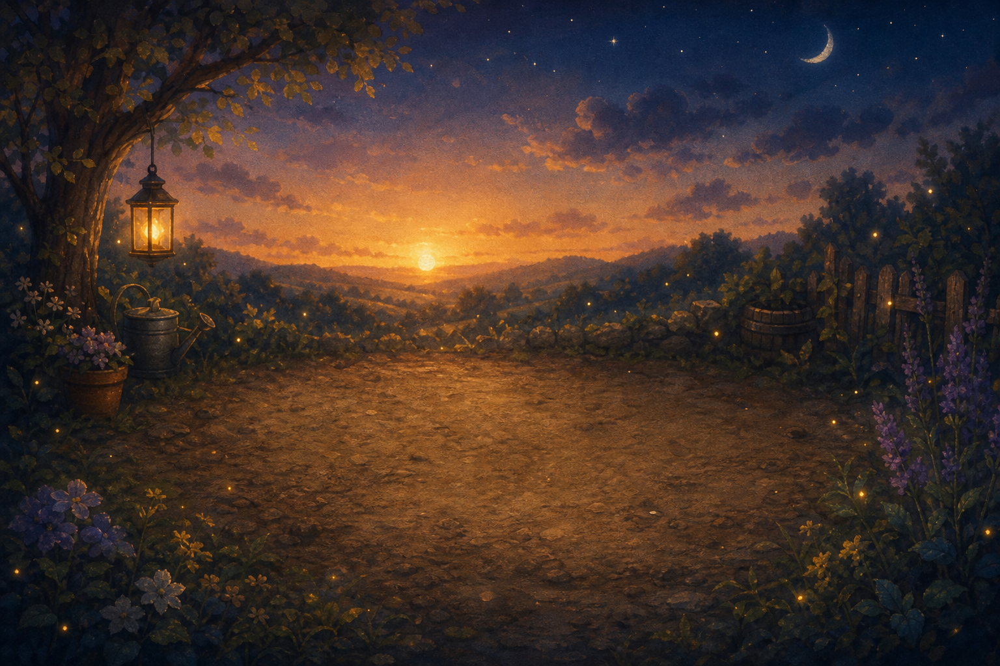

# Alan's Garden

**If flowers could think, how would they talk to each other?**

A puzzle game where flowers aren't plants — they're *tiny programs*. You give each
flower a growth rule (which directions it spreads, who it avoids, who it needs,
how much support it requires), press **Sunrise**, and watch a pattern bloom across
the bed. Win by growing the garden into the target shape **exactly** — no spilling,
no gaps.

A tribute to **Alan Turing** built for the **June Solstice Game Jam 2026**.



## The Turing tribute

Most people know Turing for codebreaking and the Turing machine. Fewer know that
late in his life he was fascinated by **morphogenesis** — how a chemical
reaction-diffusion system can spontaneously produce the spots, stripes, and
spirals we see in nature (*The Chemical Basis of Morphogenesis*, 1952).

Alan's Garden turns that idea into play. Each flower runs a deterministic
**cellular automaton** rule. Two simple primitives — **activation** ("only grow
next to X") and **inhibition** ("avoid growing next to X") — are the discrete pair
behind Turing patterns, and they're enough to make edged borders, isolated spots,
and clean partitions *emerge* from a single seed. You're not painting the picture;
you're writing the rule that grows it.

## How to play

- The faint **ghost cells** on the board are the target pattern (a tinted ghost
  means that cell wants that color). `#` is a rock.
- Each flower has direction toggles (↑ → ↓ ←) plus rule pills:
  - **avoid X** — inhibition: don't grow next to color X
  - **need X** — activation: only grow next to color X
  - **cluster ≥k** — only grow into cells already touching k of its own kind
- Press **☀ Sunrise** to let the garden grow step by step (the sun bar is your step budget).
- Grow into the target exactly and it **blossoms**. Miss and it tells you plainly
  how many cells are short or spilled.
- **Hint** fills a known solution, **Reset** clears back to seeds, **Next** advances.

Keyboard: `1`–`9` jump to a level, `←/→` prev/next, `Space` Sunrise, `H` hint,
`R` reset.

## Build & run (macOS)

Requires a Mac with Swift (Xcode or the Swift toolchain).

```bash
cd prototype
swift run GardenApp        # graphical version (SpriteKit)
```

> Launch from a real **Terminal.app** or Xcode so the window can appear.

Command-line (frame-by-frame ASCII) version and rule sandbox:

```bash
cd prototype
swift run garden --level 5            # inhibition: B keeps its distance from A
swift run garden --level 9            # clustering: fill the frame, no spilling
swift run garden --level 2 --rule A=NSEW --steps 3   # deliberately spill
swift run garden --list
swift test                            # run the test suite
```

Rule syntax: `A=NSEW` (all directions) · `A=E` (east only) · `B=NSEW~A` (avoid A) ·
`B=NSEW+A` (need A) · `A=NSEW*2` (cluster, needs ≥2 same-color neighbors).

## Levels (a gentle mechanic ramp)

| # | Name | Teaches |
|---|------|---------|
| 1 | First Bloom | Four-way bloom → diamond |
| 2 | Garden Path | Direction control (east-only line vs. spilling bloom) |
| 3 | Around the Stone | Rocks carve an L-corridor; flooding fills the path |
| 4 | Two Beds | Two species split a bed exactly down the middle |
| 5 | Keep Your Distance | **Inhibition** — B fills the bed but leaves a gap around A |
| 6 | Climbing Rose | **Activation** — B grows only beside the trellis A (`+A`) |
| 7 | Tide Pools | Inhibition as pattern — Turing spots as negative space |
| 8 | Sunrise Corner | **Budget** — fill the NE quarter using only 2 directions |
| 9 | Fill the Frame | **Clustering** — fill the outline without spilling (`*2`) |
| 10 | Two Quilts | Two species, two clustered blocks, no bleeding |

## Project layout

```
DESIGN.md                  game design document
prototype/
  Sources/GardenCore/      reusable engine (grid, deterministic CA, levels, ASCII renderer)
  Sources/garden/          command-line frame-by-frame demo
  Sources/GardenApp/       macOS GUI (pure-code AppKit host + SpriteKit scene)
  Tests/                   determinism / monotonic growth / every level solvable
  Art/                     hand-painted assets + Python cutout scripts
  tools/demo.lua           Hammerspoon driver that auto-plays the demo with subtitles
```

See [`prototype/README.md`](prototype/README.md) for developer notes (in Chinese).

## Demo

The submission video shows two real solves — Level 5 (inhibition) and Level 9
(clustering) — driven automatically by [`prototype/tools/demo.lua`](prototype/tools/demo.lua),
with timed subtitles. (Recorded with macOS screen capture; music added in post.)

## Credits

- Design & code: thehwang
- Music: *Gymnopédie No. 1* by Kevin MacLeod (incompetech.com), licensed under
  [Creative Commons: By Attribution 4.0](https://creativecommons.org/licenses/by/4.0/).
- Built for the June Solstice Game Jam 2026.

## License

Code released under the MIT License — see [LICENSE](LICENSE).
